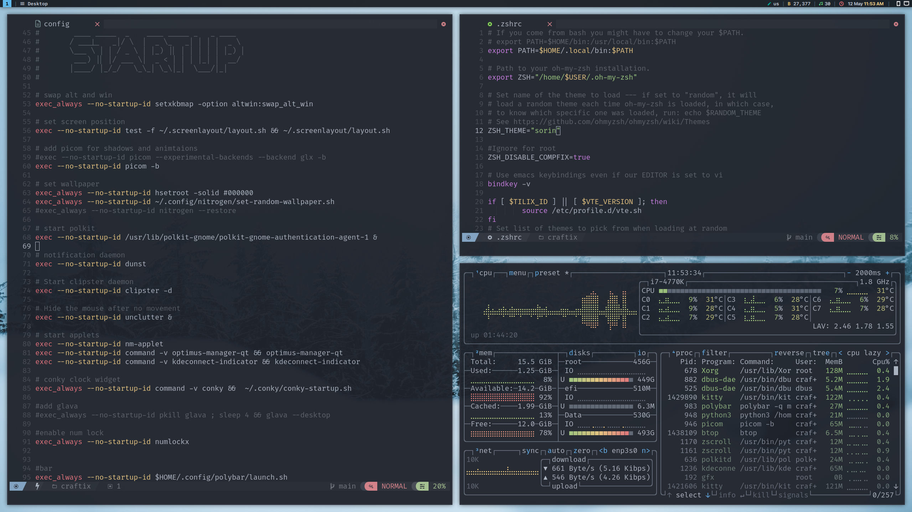
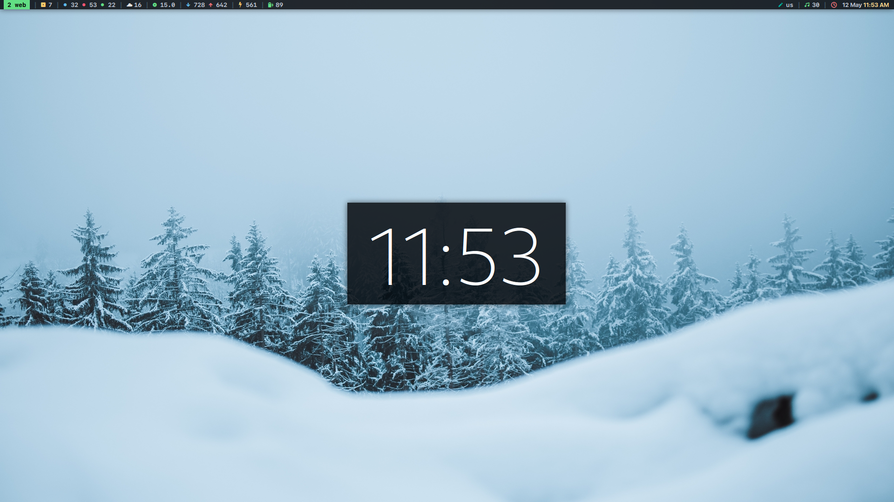

# Craft1x's Dotfiles




## Installation

You will need `git` and GNU `stow`

Clone into your `$HOME` directory or `~`

```bash
git clone https://github.com/Craft1x/dots.git ~
```

Run `stow` to symlink everything or just select what you want

```bash
stow */ # Everything (the '/' ignores the README)
```

```bash
stow zsh # Just my zsh config
```
